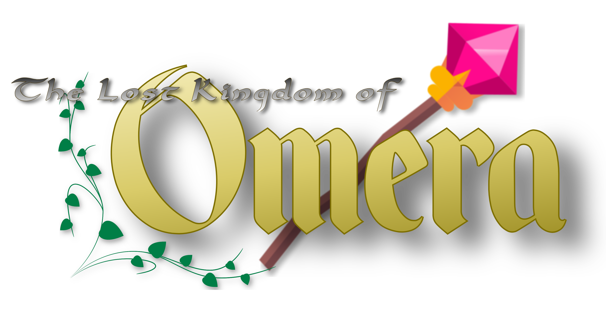

# The Lost Kingdom of Omera

An attempt to create a D&D campaign for very young players (ie, my six year old daughter and her friends). Simple text and aids, child-friendly storylines, focus on puzzle solving and lateral thinking and little combat. Combat should be largly avoidable. Players should receive XP for puzzle solving and completing quests and not combat.

Players will start with little knowledge of the world. Their village is largely isolated. They will learn lore as they go which will be a reward.

## Synopsis

_The lost kingdom of Omera has become a myth. A lost age of magic and enlightement before the dark era, before the clash of kings, before the great forest spread across the ruins.
In the small village of Harwich a storyteller entertains the childtren with tales of these times and inspires in their minds hopes and dreams that may change the world forever._
