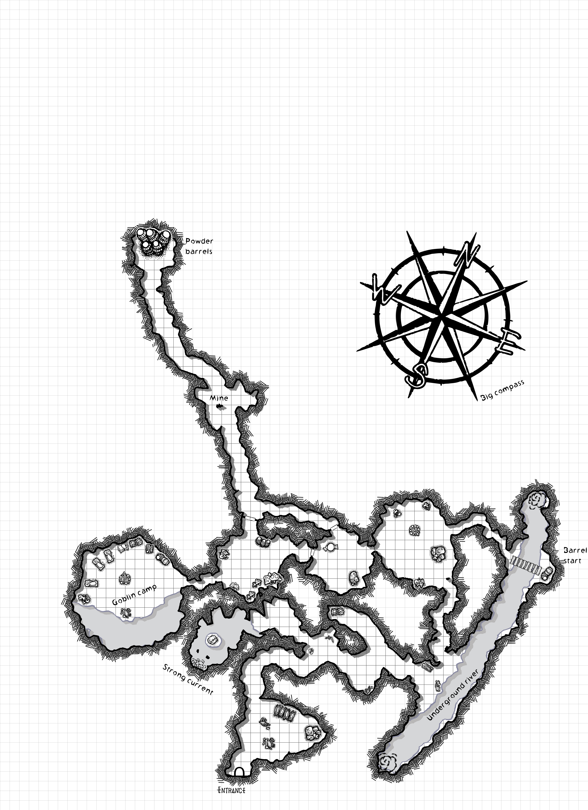

The piglet ran off towards the old Smugglers Cave.

The skinny goblins in the guard cave say their chief has the piglets, and he's fattening him up for dinner. They won't let you speak to him unless you race them in barrels.

The goblins at the mine won't let you pass, unless you promise to ask the foreman for some more barrels of powder. they can't ask because they spilled the last one into the river doing a barrel race and he's still angry.

The foreman says they can have one more barrel and need to make do, but only if you go to the river to fetch a pail of water so he can water the mushrooms.

The Goblin chief says they are going to eat the pig as they are sick of mushrooms, but they'd rather have seed cake. They know you can bring them seed cake because they can smell it from the village. If you get them some of Megrin's delicious seed cakes they'll gladly swap them for the piglet.

### NPCS

**Sog, the chieftans wayward son.**

**Lug and Lugg, miners**

**Grit, the foreman**

**Chief Tog, the old Goblin chief.**

**Piglet**