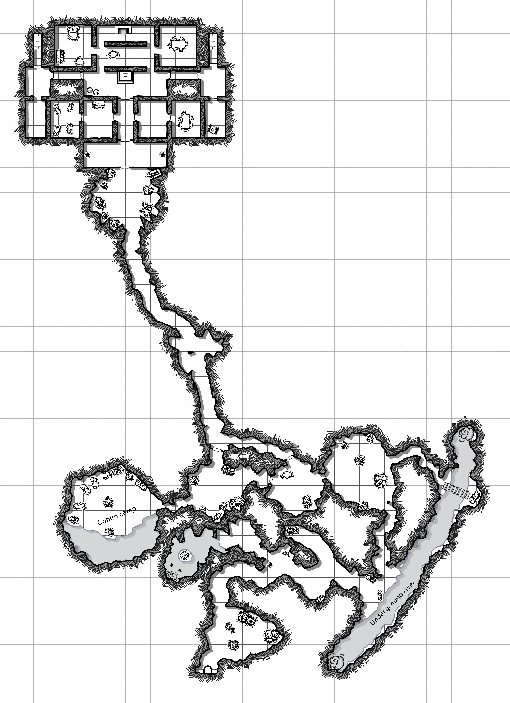

## The King Under the Mountain

Returning with the seedcakes, the heroes find that Lug and Lugg have blown the barrels of powder and "d-d-dwarves" have kidnapped the chief, his son and the piglet and plan to eat all three.

The "d-d-dwarves" are actually deep gnomes who have taken up residence in an old dwarven outpost. They will have to parlay with their king to rescue the goblins and the piglet.